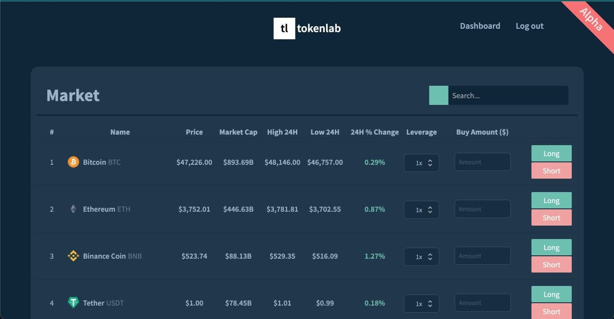

# Token Lab

_(Current stage - **Alpha**)_


_(Colors inspired by [IndieHackers](https://indiehackers.com))_

## Backend

**[Tokenlab Backend Repository](https://github.com/raulrusu88/tokenlab-backend)**

## How to run it:

### Install dependecies

If you're using yarn, instead of npm, please before installing all the dependencies remove the package-lock.json file.

```bash
npm install
# or
yarn install
```

### Run the development server:

```bash
npm run dev
```

Open [http://localhost:3000](http://localhost:3000) with your browser to see the result.

## List

- [x] Live data from CoinGecko API
- [x] Log In with Google Auth
- [ ] Dashboard where user's can see their current live trades
- [ ] Trading History page where user's can see their past trades
- [ ] Search for specific crypto coin
- [ ] Working leverage
